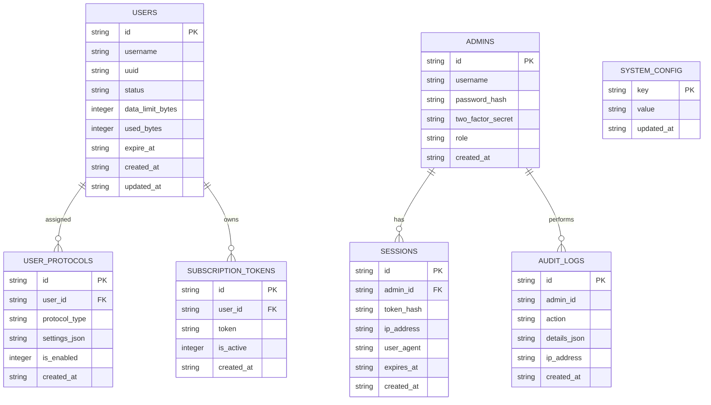

# Project Amnion 2.0 - Database Specification

## 1. Introductie & Database Keuze

Project Amnion 2.0 maakt gebruik van **SQLite3** met **WAL (Write-Ahead Logging)** modus als relationele database engine.

### Waarom SQLite met WAL-modus?
- **Zero Memory Overhead**: Geen aparte database daemon (zoals PostgreSQL of MySQL) die 150MB+ RAM verbruikt.
- **Hoge Concurrency**: In WAL-modus blokkeren lezers de schrijvers niet, en schrijvers de lezers niet.
- **Performance**: Kan 50.000+ leestransacties/sec en 5.000+ schrijftransacties/sec verwerken op een standaard SSD.
- **Klein Schijfgebruik**: Minder dan 5 MB schijfruimte in productie, perfect voor onze 10 GB SSD VPS-limiet.

---

## 2. PRAGMA Instellingen

Bij het initialiseren van de databaseverbinding in `db.ts` worden de volgende PRAGMA's afgedwongen:

```sql
PRAGMA journal_mode = WAL;
PRAGMA busy_timeout = 5000;
PRAGMA synchronous = NORMAL;
PRAGMA foreign_keys = ON;
```

---

## 3. Database Schema Diagram



---

## 4. Tabel Definities (DDL)

```sql
-- Gebruikers tabel
CREATE TABLE IF NOT EXISTS users (
    id TEXT PRIMARY KEY,
    username TEXT NOT NULL UNIQUE,
    uuid TEXT NOT NULL UNIQUE,
    status TEXT CHECK(status IN ('active', 'disabled', 'expired')) DEFAULT 'active',
    data_limit_bytes INTEGER DEFAULT 0, -- 0 = onbeperkt
    used_bytes INTEGER DEFAULT 0,
    expire_at DATETIME NULL,
    created_at DATETIME DEFAULT CURRENT_TIMESTAMP,
    updated_at DATETIME DEFAULT CURRENT_TIMESTAMP
);

-- Protocol toewijzingen per gebruiker
CREATE TABLE IF NOT EXISTS user_protocols (
    id TEXT PRIMARY KEY,
    user_id TEXT NOT NULL,
    protocol_type TEXT CHECK(protocol_type IN ('hysteria2', 'tuic', 'vless_reality')) NOT NULL,
    settings_json TEXT DEFAULT '{}',
    is_enabled INTEGER DEFAULT 1,
    created_at DATETIME DEFAULT CURRENT_TIMESTAMP,
    FOREIGN KEY(user_id) REFERENCES users(id) ON DELETE CASCADE,
    UNIQUE(user_id, protocol_type)
);

-- Admin Beheerders tabel
CREATE TABLE IF NOT EXISTS admins (
    id TEXT PRIMARY KEY,
    username TEXT NOT NULL UNIQUE,
    password_hash TEXT NOT NULL,
    two_factor_secret TEXT NULL,
    role TEXT CHECK(role IN ('admin', 'viewer')) DEFAULT 'admin',
    created_at DATETIME DEFAULT CURRENT_TIMESTAMP
);

-- Admin Sessies (Server-side Session Cookies)
CREATE TABLE IF NOT EXISTS sessions (
    id TEXT PRIMARY KEY,
    admin_id TEXT NOT NULL,
    token_hash TEXT NOT NULL UNIQUE,
    ip_address TEXT NOT NULL,
    user_agent TEXT NULL,
    expires_at DATETIME NOT NULL,
    created_at DATETIME DEFAULT CURRENT_TIMESTAMP,
    FOREIGN KEY(admin_id) REFERENCES admins(id) ON DELETE CASCADE
);

-- Subscription Tokens per Gebruiker (Hiddify Next Subscriptions)
CREATE TABLE IF NOT EXISTS subscription_tokens (
    id TEXT PRIMARY KEY,
    user_id TEXT NOT NULL,
    token TEXT NOT NULL UNIQUE,
    is_active INTEGER DEFAULT 1,
    created_at DATETIME DEFAULT CURRENT_TIMESTAMP,
    FOREIGN KEY(user_id) REFERENCES users(id) ON DELETE CASCADE
);

-- Audit & Systeem Logging
CREATE TABLE IF NOT EXISTS audit_logs (
    id TEXT PRIMARY KEY,
    admin_id TEXT NULL,
    action TEXT NOT NULL,
    details_json TEXT DEFAULT '{}',
    ip_address TEXT NULL,
    created_at DATETIME DEFAULT CURRENT_TIMESTAMP
);

-- Systeem Configuratie (KV Store)
CREATE TABLE IF NOT EXISTS system_config (
    key TEXT PRIMARY KEY,
    value TEXT NOT NULL,
    updated_at DATETIME DEFAULT CURRENT_TIMESTAMP
);
```

---

## 5. Opschoning & Retentie Beleid (10 GB SSD Constraint)

Om te voorkomen dat de database ongemerkt groeit op VPS'en met beperkte opslag:
1. **Audit Logs Retentie**: Automatische opschoning van `audit_logs` ouder dan **30 dagen**.
   ```sql
   DELETE FROM audit_logs WHERE created_at < datetime('now', '-30 days');
   ```
2. **Verlopen Sessies Opschonen**: Elk uur verwijdert een achtergrondtaak alle verlopen sessies:
   ```sql
   DELETE FROM sessions WHERE expires_at < CURRENT_TIMESTAMP;
   ```
3. **Periodieke Vacuum**: Maandelijks voert de backend het commando `PRAGMA incremental_vacuum;` of `VACUUM;` uit via het back-upscript.
